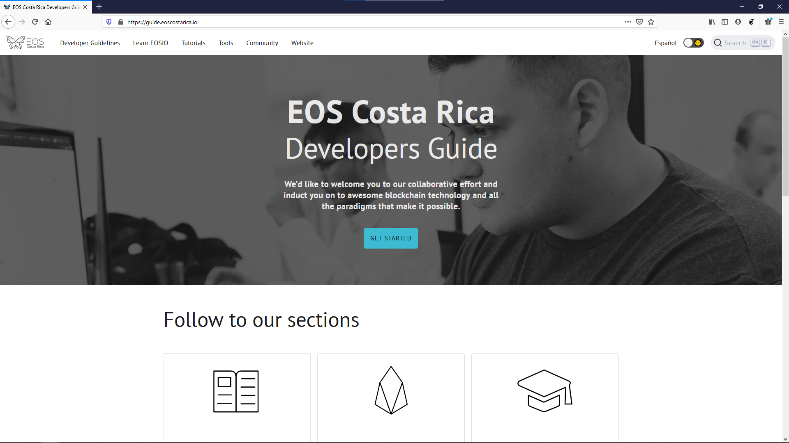

# EOS COSTA RICA DEVELOPER GUIDES
    

EOS Costa Rica Developers Documentation Site.



## About the Project

In this site you will find the resources collected in the day-to-day life of EOS Costa Rica collaborators. Feel free to collaborate, comment and suggest changes / ideas to improve the site.

## Table of Contents

1. About The Project
1. Content Table
1. Project Purpose
1. Version
1. Tech Stack
1. Development Environment
1. File Structure
1. License
1. Contributing
1. Contributors
1. About EOS Costa Rica

## Project Purpose

This project is meant to serve as a tool for assisting with new developer on-boarding. Initially created by a group of university students to facilitate getting up to speed with other team members and contribute to open source projects. It's main purpose is to provide guidance to new team members and accelerate becoming familiar with processes and the culture at EOS Costa Rica.

## Tech Stack
- React.js - React 16✨, React Router 5.
- Material-ui/core - React components for faster and easier web development universal-authenticator-library - A library for allowing apps to easily use different auth providers.
- Core - React components for faster and easier web development.
- Lint - ESlint.
- Styles - Material-UI Theme (customizable).
- Docusaurus - Open source tool to build, implement and maintain web documentation.

### Getting Started

Give the needed instruction to run the project locally, for example:

#### **Prerequisites**

- `yarn`
- `git`
- `node.js`

#### **Installation**

1. Clone the repository

    `
    git clone https://github.com/eoscostarica/guide.eoscostarica.io.git
    `

1. Move to the appropriate directory

    `
    cd guide.eoscostarica.io.git
    `

1. Install yarn packages

    `
    yarn
    `

1. Run the project

    `
    yarn start
    `


## File Structure
```sh
guide.eoscostarica.io/
├── .github ...................... Version management system
│ ├── workflows .................. Work flow
│ | └── nodejs.yml 
│ └── ISSUE_TEMPLATE.md .......... Templates for requests or reporting problems
│   ├── bug_report.md 
│   └── feature_request.md
├── docs ......................... Markdown files
├── src .......................... React custom components  
│ ├── css ........................ Style sheets
│ | ├── custom.css
│ | └── homepage.css
│ └── pages ...................... Components that form the main structure of the website
│ 	├── styles.module.css
│   ├── index.js
│   └── Footer
├── static ....................... Static directory
│ ├── img
│ └── CNAME
├── .all-contributorsrc .......... Contributors Information
├── .gitignore ................... Determine which files or directories should not be uploaded to Git
├── docusaurus.config.js ......... Docusaurus Configuration
├── package.json ................. History of installed packages and dependency optimization
├── sidebar.js ................... Specify the order of the documents in the side navigation
├── yarn.lock .................... Dependency version history
└── README.md .................... Documentation of guide.eoscostarica.io
```

## License

MIT © [EOS Costa Rica](https://eoscostarica.io)

## Contributing

We use a Kanban-style board. That's were we prioritize the work. [Go to Project Board](https://github.com/eoscostarica/guide.eoscostarica.io/projects/1).

If you want to make a contribution, please follow the next steps:

1. Fork the Project
1. Create your Feature Branch (`git checkout -b feature/AmazingFeature`)
1. Add your Changes to Commit (`git add <fileName>`)
1. Commit your Changes (`git commit -m '<type>(<scope>): <subject>'`)
1. Push to the Branch (`git push origin feature/AmazingFeature`)
1. Open a Pull Request

Please Read EOS Costa Rica's [Open Source Contributing Guidelines](https://guide.eoscostarica.io/docs/open-source-guidelines/) for more information about programming conventions.

If you find a bug, please report big and small bugs by [opening an issue](https://github.com/eoscostarica/guide.eoscostarica.io/issues/new/choose).

## About EOS Costa Rica

<p align="center">
	<a href="https://eoscostarica.io/">
		
	</a>
</p>

EOS Costa Rica is an independently-owned, self-funded, bare-metal Genesis block producer that provides stable and secure infrastructure for EOSIO blockchains. We support open source software for our community while offering enterprise blockchain development and custom smart contract development for our clients.

[eoscostarica.io](https://eoscostarica.io/)