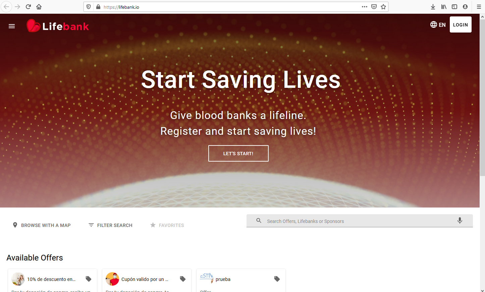

README is a file that brings a little description about the whole project, which contains an introduction and explanation of this one. The kind of information that can be describe here is information requeried to understand the project and its structure or purpose. Then, we will give a template to create a README file for a new project.

***

## Gif or image introduction

Is simple and can sound so easy and yes, It does, but the impact that a Gif or Image can produce is too big. The viewer adquire the needed information to get interested in the project. For example:



## About The Project

Give a general description of the project brings a general view about the **project as a product**, for example:

*"Lifebank is an EOSIO-based dapp that helps local communities create a virtuous circle of value exchange between three parties — eligible life donors, community donation centers, and participating local businesses (sponsors).*

*Lifebank is an initiative of EOS Costa Rica, a company that develops blockchain-based solutions to solve real-world problems. Lifebank is our entry to the Coding for Change challenge organized by leading blockchain company, Block.one."*

## Content table
With a good view about the information structure can make the reader go to the specific needed information, so then give a good view of the information with a content table will make easier this process. For example:

**Content table**
1. Little gifs introduction
2. Introduction / About The Project
3. Content table
4. Project purpose
5. Version
6. Teach Stack
7. Development Environment
8. Installation (Before start, First time setup)
9. Development (Quick start)
10. File Structure
11. License
12. Contributing
13. Contributors
14. About Company

## Project porpuse

Describes the reason of why this was made, for example: 

*"We identified two main problems: a blood donation shortage and a local economic slowdown. Amid the COVID-19 outbreak, blood banks urgently need donors. People who are potential qualifying donors are prompted to stay home and isolate. As donations plummet and demand for blood and plasma increases, blood banks are experiencing a pronounced global shortage.*

*Moreover, the pandemic is impacting local economies due to a generalized lockdown. Small businesses that rely on the local community must think of ways to incentivize customers to buy as soon as restrictions are lifted."*

## Version
Know what version of the project is, could helps others to debug problems, give it differents solutions or approaches, for this reason, is needed to specify the lastest version of the project, for example:

:::note v0.1.0-beta.xx
Evodex is ready for our first group of beta testers to try the next generation decentralized exchange for EOS

Currently evodex is still in beta pre-release v0.1.0-beta.xx

We release the production software version using github tags following Semver.

We also use the git commit messages to generate the project change log.

Using the yarn version command you can update the version of your package via the command line.
:::

## Teach Stack
The purpose is to make the user know the main technology were needed to develop the project, so the user could understand the project with a new kind of view, for example, the information that could be given here is:


- React.js - React 16✨, React Router 5
- Rematch/core - Rematch a Redux Framework
- Material-ui/core - React components for faster and easier web development universal-authenticator-library - A library for allowing apps to easily use different auth providers
- Lint - ESlint
- Styles - Material-UI Theme (customizable)


## Development Environment

Is important to specify where were the project developed, in case someone else wants to make a contribution to the project progress.

### Quick start

- Clone this repo using git clone --depth=1 https://github.com/eoscostarica/evodex.git <YOUR_PROJECT_NAME>
- Move to the appropriate directory: cd <YOUR_PROJECT_NAME>.
- Run yarn in order to install dependencies. At this point you can run yarn start to see the example app at http://localhost:3000.

### Getting Started
Give the needed instruction to run the project locally, for example:

#### **Prerequisites**

```
yarn
```

#### **Installation**

1. Clone the repository

    `
    git clone https://github.com/your_username_/Project-Name.git
    `
2. Install yarn packages

    `
    yarn install
    `

    or just

    `
    yarn
    `
3. Run the project
    
    `
    yarn start
    `

## File Structure
This could help the reader understand the organization inside the project, for example:

```
/
├── public
│   ├── index.html
│   └── manifest.json
├──  src
│   ├── api
│   ├── components
│   ├── config
│   ├── containers
│   ├── models
│   ├── routes
│   ├── theme
│   ├── utils
│   ├── App.js
│   ├── index.js
│   └── store.js
├── .dockerignore
├── .gitignore
├── .env.example
├── .eslintrc
├── .prettierrc
├── Dockerfile
├── LICENSE
├── README.md
├── docker-compose.yml
├── nginx.conf
└── package.json
```

## License

With this section, clarify what can and cannot do with the code, one of the licenses could be:

1. MIT © EOS Costa Rica
2. GNU General Public License
3. Eclipse Public License
4. Creative Commons
5. Apache License

## Contributing

Describes the guidelines to follow to make a contribution to the project, for example:

[Open Source Contributing Guidelines](https://guide.eoscostarica.io/docs/open-source-guidelines/)

And also, specify the correct way to do this, for example:


1. Fork the Project
2. Create your Feature Branch (`git checkout -b feature/AmazingFeature`)
3. Commit your Changes (`git commit -m '<type>(<scope>): <subject>'`)
4. Push to the Branch (`git push origin feature/AmazingFeature`)
5. Open a Pull Request


## Contributors

List the people who work in the project.

## About Company

Give a description about the company.

## Complete Examples

Some cool projects with cool readme files could be found here:

1. [Evodex](https://github.com/eoscostarica/evodex/blob/develop/README.md)
2. [Lifebank.io](https://github.com/eoscostarica/lifebank)
3. [EOS RATE](https://github.com/eoscostarica/eos-rate)